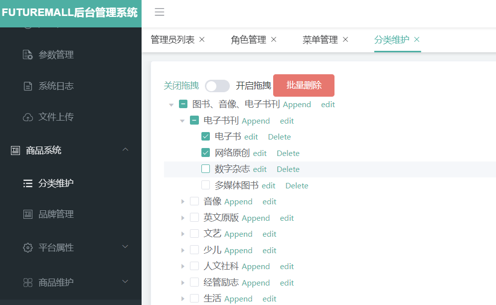
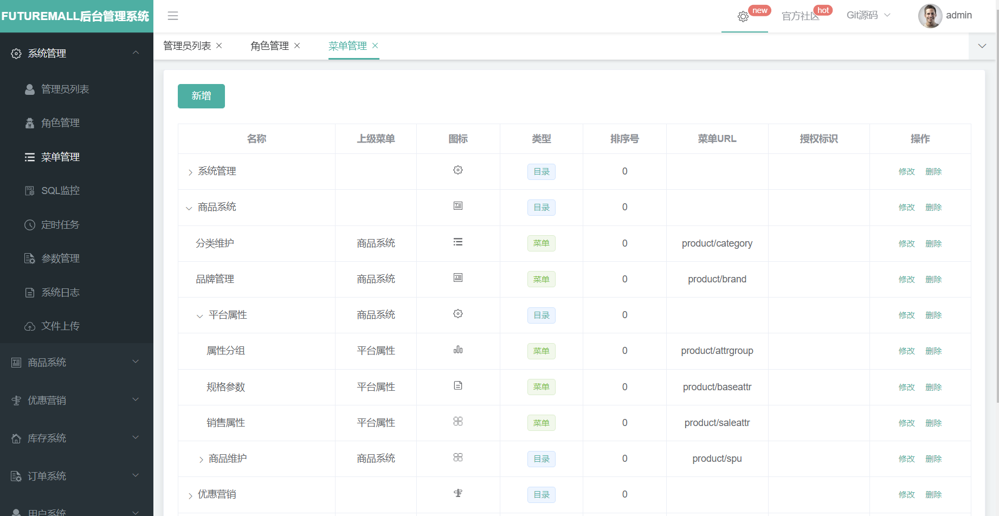
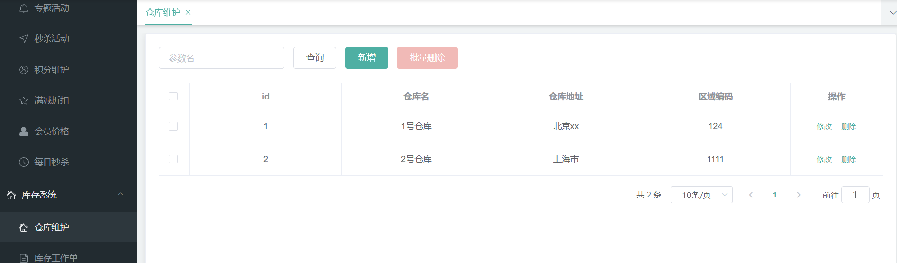
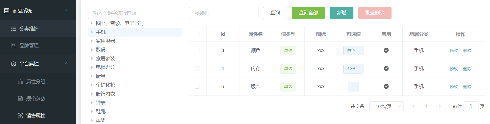

# futuremall

## 一、项目简介

>本项目是一套电商系统。基于Spring + SpringBoot + Mybatis-Plus + SpringCloud + SpringCloudAlibaba实现，采用Docker容器部署，搜索引擎使用Elasticsearch。<br>前台商城系统包括：用户登录、注册、商品搜索、商品详情、购物车、下订单流程等模块。后台管理系统包括：系统管理、商品系统、优惠营销、库存系统、订单系统、用户系统、内容管理等七大模块。


## 二、项目演示

后端登录界面部分演示

    1、登录界面

<div align=center> 
</div>

    2、三级分类

<div align=center> 
</div>

    3、菜单管理

<div align=center> 
</div>

    4、仓库维护

<div align=center> 
</div>

    5、销售属性

<div align=center> 
</div>

    6、仓库维护

<div align=center> 
</div>


## 三、项目结构

futuremall<br>
├── futuremall-common -- 工具类及通用代码<br>
├── futuremall-coupon -- 优惠卷服务<br>
├── futuremall-gateway -- 统一配置网关<br>
├── futuremall-order -- 订单服务<br>
├── futuremall-product -- 商品服务<br>
├── futuremall-search -- 检索服务<br>
├── futuremall-third-party -- 第三方服务<br>
├── futuremall-ware -- 仓储服务<br>
├── futuremall-member -- 会员服务<br>
└── renren-generator -- 人人开源项目的代码生成器

| 技术栈             | 简介                     | 官方网站                                        |
| ------------------ | ------------------------ | ----------------------------------------------- |
| SpringBoot         | 容器+MVC框架             | https://spring.io/projects/spring-boot          |
| SpringCloud        | 微服务，分布式           | https://spring.io/projects/spring-cloud         |
| SpringCloudAlibaba | 组件                     | https://spring.io/projects/spring-cloud-alibaba |
| MyBatis-Plus       | ORM框架                  | https://mp.baomidou.com                         |
| renren-generator   | 人人开源项目的代码生成器 | https://gitee.com/renrenio/renren-generator     |
| Elasticsearch      | 搜索引擎                 | https://github.com/elastic/elasticsearch        |
| Springsession      | 分布式缓存               | https://projects.spring.io/spring-session       |
| Redisson           | 分布式锁                 | https://github.com/redisson/redisson            |
| Docker             | 容器                     | https://www.docker.com                          |
| OSS                | 对象云存储               | https://github.com/aliyun/aliyun-oss-java-sdk   |


| 开发工具          | 简介                    | 官方网站                                        |
| ------------- | ----------------------- | ----------------------------------------------- |
| IntelliJ IDEA | Java开发工具            | https://www.jetbrains.com/idea/download         |
| RedisDesktop  | Redis缓存连接可视化工具 | https://redisdesktop.com/download               |
| X-shell       | Linux远程连接可视化工具 | http://www.netsarang.com/download/software.html |
| Navicat       | 数据库连接工具          | http://www.formysql.com/xiazai.html             |
| Postman       | 接口测试工具            | https://www.postman.com                         |
| Jmeter        | 压力测试工具            | https://jmeter.apache.org                       |
| Typora        | Markdown编辑器          | https://typora.io                               |

| 工具          | 版本号 | 网址                                                         |
| ------------- | ------ | ------------------------------------------------------------ |
| JDK           | 1.8    | https://www.oracle.com/java/technologies/javase/javase-jdk8-downloads.html |
| Mysql         | 5.7    | https://www.mysql.com                                        |
| Redis         |        | https://redis.io/download                                    |
| Elasticsearch | 7.6.2  | https://www.elastic.co/downloads                             |
| Kibana        | 7.6.2  | https://www.elastic.co/cn/kibana                             |
| RabbitMQ      | 3.8.5  | http://www.rabbitmq.com/download.html                        |
| Nginx         | 1.1.6  | http://nginx.org/en/download.html                            |


## 四、快速开始：

**基本用法**：

```
run futuremall
```

## 五、更多设置

在pom.xml文件中自行调整版本，可根据需求进行配置。


